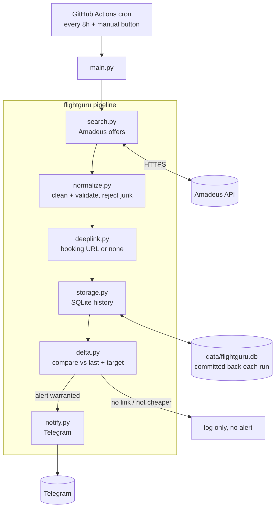

# ARCHITECTURE.md

## Components
- **main.py** — entry point; runs the steps in order and handles errors.
- **search.py** — asks Amadeus for fares (Phase 2).
- **normalize.py** — validates and cleans; home of the "never invent data" rule (Phase 2).
- **deeplink.py** — builds a booking link or returns None (Phase 2).
- **storage.py** — SQLite read/write (Phase 3).
- **delta.py** — decides whether to alert (Phase 3).
- **notify.py** — sends Telegram, plain text (Phase 4).

## Why GitHub Actions instead of a server
The job is periodic, not always-on. A scheduled workflow is free, needs no
server to manage, and committing the SQLite file back each run both persists
history and keeps the schedule alive. See [DECISIONS.md](DECISIONS.md).
